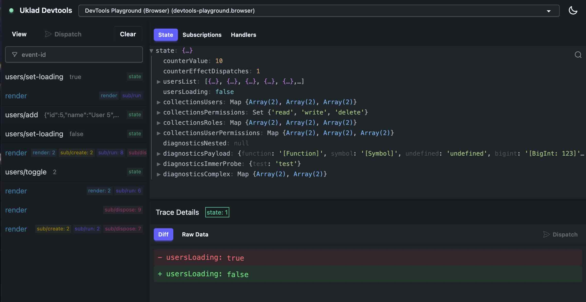

<div align="center">

# 🛠️ Uklad DevTools

**Runtime observability for Uklad apps — built for AI agents first, humans second**

[](https://opensource.org/licenses/MIT)
[](https://www.npmjs.com/package/@ukladjs/devtools)
[](https://github.com/ukladjs/uklad/pulls)

  
</div>

---

## ✨ What is Uklad DevTools?

Uklad DevTools gives anything working on a [`@ukladjs/core`](https://github.com/ukladjs/uklad) app — a coding agent or a human — live access to the running application: current state, registered handlers, execution traces, and, when explicitly granted, the ability to dispatch events and observe exactly what they did.

For **AI agents** (Claude Code, Codex, Cursor), that turns debugging from "read the source and guess" into an inspect-first loop over [MCP](https://modelcontextprotocol.io). When dispatch is deliberately enabled, the same loop can act and verify from the returned state patches and effects — no full-state dumps or browser required.

For **humans**, the same server hosts a real-time web dashboard with state inspection, event tracing, and performance profiling.

---

## 🤖 Agentic Development

### The two-step path

Install the [Uklad Agent Toolkit](https://github.com/ukladjs/agent-toolkit) plugin once, globally — it teaches your agent the whole Uklad workflow (skills + MCP configuration):

**Claude Code**

```text
/plugin marketplace add ukladjs/agent-toolkit
/plugin install uklad-agent-toolkit@ukladjs
```

**Codex**

```bash
codex plugin marketplace add ukladjs/agent-toolkit
# then inside Codex: /plugins → install "Uklad Agent Toolkit"
```

Then just ask for the outcome you want:

```text
> Create a React/Vite site using Uklad (@ukladjs/core).

> Migrate this app's state management to Uklad (@ukladjs/core).

> Add category filtering and verify it works.
```

That's it. The plugin's skill installs the release-matched `@ukladjs/core` and `@ukladjs/devtools`, enables dev-only operation evidence, adds and starts the project-local `devtools:mcp` server script, and verifies its work through focused MCP evidence instead of broad source rereads.

### What the agent gets

The plugin starts a version-pinned MCP bridge ([@ukladjs/devtools-mcp](https://github.com/ukladjs/uklad/tree/main/packages/devtools-mcp)) that connects to the project-local DevTools server:

| Tool                       | What it answers                                                                                                                                        |
| -------------------------- | ------------------------------------------------------------------------------------------------------------------------------------------------------ |
| `app_status`               | Is an app connected? Browser or headless? Did its DevTools session change?                                                                             |
| `get_handlers`             | Which event/effect/subscription ids exist?                                                                                                             |
| `get_state`                | What is the state _at this path_ (scoped reads, not full dumps)?                                                                                       |
| `eval_sub`                 | What does any registered subscription return, mounted or not?                                                                                          |
| `get_active_subs`          | What are the current values of mounted subscriptions and their active dependencies?                                                                    |
| `dispatch_and_wait`        | Preferred act-and-verify path: what settled across the joined event cascade, including revisions, state status, effects, errors, and optional patches? |
| `dispatch_event`           | Compatibility action for older runtimes, with a trace-derived outcome.                                                                                 |
| `get_traces` / `get_trace` | What happened recently, including what the agent didn't initiate?                                                                                      |

When mutation is explicitly enabled, prefer `dispatch_and_wait` on an operation-enabled runtime. Its immutable snapshot settles the joined cascade without depending on trace storage; bounded state patches are available when configured. Use `dispatch_event` only for older runtimes. The read-side counterpart is `eval_sub`, which proves a derived value before any view mounts it.

### Manual setup (Cursor, Claude Desktop, or no plugin)

If you're not using the agent toolkit plugin, the setup the skill automates is four small steps:

1. **Install DevTools in your project:**

   ```bash
   npm install --save-dev @ukladjs/devtools@0.2.0
   ```

2. **Enable it in development** (app entry point; adjust the env guard for non-Vite apps):

   ```typescript
   import { enableDevtools } from '@ukladjs/devtools';
   import { createUkladInspector } from '@ukladjs/core/devtools';
   import { runtime } from './app/uklad/runtime';

   if (import.meta.env.DEV) {
     enableDevtools(createUkladInspector(runtime), {
       operations: { evidence: { stateChanges: 'patches' } },
     });
   }
   ```

3. **Add and run the project-local server script.** `--mcp` enables authenticated inspection and trace storage, but remains read-only:

   ```json
   {
     "scripts": {
       "devtools:mcp": "uklad-devtools --mcp --host 127.0.0.1 --port 4000 --allow-origin http://localhost:5173"
     }
   }
   ```

   ```bash
   npm run devtools:mcp
   ```

   Replace the origin with the exact origin of your browser dev server. Repeat
   `--allow-origin` when the app uses more than one origin, or omit it for a
   headless-only runtime.

4. **Point your MCP client at the bridge** (Claude Desktop: `~/Library/Application Support/Claude/claude_desktop_config.json`; Cursor: `.cursor/mcp.json`):
   ```json
   {
     "mcpServers": {
       "uklad-devtools": {
         "command": "npx",
         "args": [
           "--yes",
           "--package=@ukladjs/devtools-mcp@0.2.0",
           "uklad-devtools-mcp",
           "--host",
           "127.0.0.1",
           "--port",
           "4000"
         ]
       }
     }
   }
   ```

Then run your app (browser tab or headless, below) and ask the agent things like:

- "What's the current app state and what user actions led to it?"
- "Find event handlers slower than 100ms"

If the agent must mutate the running app, review that need and add the capability explicitly:

```json
{
  "scripts": {
    "devtools:mcp": "uklad-devtools --mcp --allow-dispatch --host 127.0.0.1 --port 4000 --allow-origin http://localhost:5173"
  }
}
```

`dispatch_event` is always advertised because MCP clients commonly snapshot the
tool list during initialization. Without `--allow-dispatch`, calls fail with
`CAPABILITY_DENIED`; the flag grants execution, not tool discovery.

📚 **[Full MCP documentation →](https://github.com/ukladjs/uklad/blob/main/packages/devtools-mcp/README.md)**

### Headless runtime — no browser required

The Uklad state layer is React-free, so an autonomous agent doesn't need a
browser tab to run your app. Add a `src/headless.ts` entry that creates an
explicit vanilla runtime, installs the same event and subscription modules as
`main.tsx` plus Node-safe side-effect adapters (`effects.headless.ts` /
`coeffects.headless.ts` twins of the browser adapters), and connects that
runtime's inspector:

```ts
import { createUkladRuntime } from '@ukladjs/core/vanilla';
import { createUkladInspector } from '@ukladjs/core/devtools';
import { enableDevtools } from '@ukladjs/devtools';

const runtime = createUkladRuntime({
  initialState,
  runtimeId: 'app.headless',
  name: 'App (Headless)',
});
runtime.registerModule(installEvents);
runtime.registerModule(installSubscriptions);
runtime.registerModule(installHeadlessEffects);
runtime.registerModule(installHeadlessCoeffects);

enableDevtools(createUkladInspector(runtime), {
  operations: { evidence: { stateChanges: 'patches' } },
});
```

Run the entry under `tsx watch` (or `vite-node --watch`).

The SDK auto-detects `runtime: 'headless'` and connects exactly like a browser tab. `app_status` reports the runtime, the effect adapter modes (so the agent knows `local-storage-set` is memory-backed, not real), and a `sessionEpoch` for the DevTools connection. A changed epoch invalidates server-stored trace IDs; reload is one cause, while a transient SDK reconnect can leave the runtime state intact.

Headless mode requires **Node.js 22+** (the SDK connects through the global `WebSocket`). On older Node it refuses loudly instead of half-working.

See the [DevTools playground](https://github.com/ukladjs/uklad/tree/main/examples/devtools-playground) for the reference scaffold (`pnpm dev:playground:headless`) and the [MCP README](https://github.com/ukladjs/uklad/blob/main/packages/devtools-mcp/README.md#-headless-runtime-for-autonomous-agent-loops) for the adapter-split convention.

### Multiple runtimes

One server accepts browser, headless, SSR, widget, and agent-sandbox runtimes
simultaneously. Give every explicit runtime a stable ID and descriptive name,
then connect its own inspector:

```ts
import { createUkladRuntime } from '@ukladjs/core/vanilla';
import { createUkladInspector } from '@ukladjs/core/devtools';
import { enableDevtools } from '@ukladjs/devtools';

const runtime = createUkladRuntime({
  initialState,
  runtimeId: 'checkout-widget',
  name: 'Checkout widget',
});

enableDevtools(createUkladInspector(runtime), {
  operations: { evidence: { stateChanges: 'patches' } },
});
```

The dashboard selector changes the active runtime and replaces its retained
state, handlers, subscriptions, and traces as one session-scoped view. MCP
clients call `app_status` first and pass the selected `runtimeId` to later
tools. Omitting `runtimeId` remains convenient when exactly one runtime is
connected; ambiguous reads and mutations fail closed. Reconnecting the same
ID replaces only that runtime's prior socket and advances its `sessionEpoch`
while the bounded registry entry is retained.

### Security model

DevTools is development-only, but it still treats application state and agent actions as sensitive:

- **Loopback by default.** The server and SDK default to `127.0.0.1:4000`. A non-loopback bind is refused unless `--allow-remote` is present.
- **Authenticated roles.** By default, each server process generates independent 256-bit `runtime`, `ui`, and `mcp` role tokens. Local clients request the appropriate role token from `/auth/session`, and that bootstrap endpoint accepts loopback callers only. Loopback is a machine/network-namespace boundary, not a same-user boundary; see [Remote access](#remote-access). Protected HTTP APIs require a bearer token; WebSockets require the versioned subprotocol and an authenticated first message.
- **Least privilege.** `--mcp` enables inspection storage/API only. Mutation is unavailable unless `--allow-dispatch` is supplied. `--allow-restore` is a separate, reserved capability grant for restore operations and never implies dispatch permission. These grants are currently server-wide across authenticated UI and MCP clients; per-role grants are tracked as a follow-up.
- **Host and origin checks.** Loopback Host names and the dashboard's same origin are allowed automatically. Every cross-origin browser app, including another localhost port, requires a repeatable, exact `--allow-origin` value (scheme, host, and port; no path). Remote mode additionally requires exact `--allow-host` entries.
- **Data minimization.** State, traces, active subscription values, and evaluated subscription results are redacted before leaving the runtime. The default redactor masks common password, secret, token, authorization, cookie, API/private-key, session-id, payment-card, CVV, and SSN-style keys, and best-effort scrubs high-confidence credential shapes from recognized error fields. Applications should add their own PII fields and policies for secrets embedded in arbitrary prose.
- **Bounded inputs.** Control/API messages default to 64 KiB and runtime telemetry to 1024 KiB. Compressed HTTP request bodies and WebSocket compression are disabled. Oversized telemetry is diagnosed and dropped rather than silently retried indefinitely.
- **Bounded runtime data.** Runtime messages are schema-checked before storage; trace batches, patches, handler indexes, adapter maps, and retained active subscriptions have independent count limits.
- **Audited mutation.** Accepted, denied, succeeded, failed, effects-failed, and unknown agent/UI dispatch attempts are kept in a bounded in-memory audit ring and exposed through authenticated `GET /api/audit`.
- **Fail-closed compatibility.** HTTP and WebSocket clients negotiate Uklad DevTools protocol version `2`; incompatible peers are rejected instead of running with a partial contract. `app_status` reports the server, selected runtime, runtime list, and inspector protocol versions.

Authentication protects the DevTools interface; it does not make arbitrary network exposure safe. Prefer loopback or an SSH tunnel. If remote access is unavoidable, use a TLS reverse proxy, explicit credentials and exact allowlists as described below.

---

## 🧑 Human Development

The same server hosts a web dashboard — pleasant for humans, and the visual counterpart of everything the agent sees:

- **📊 State State Inspection** — visualize your entire application state in real-time
- **🔄 Real-time Event Tracing** — watch events and state changes as they happen
- **🔥 Subscriptions & Render Tracing** — see subscriptions being created, run, and disposed
- **⏱ Performance Profiling** — find slow events and subscriptions as they happen
- **🎨 Dark/light themes**, React & React Native support

If your project is already set up for agents (above), the dashboard is already there: open [http://127.0.0.1:4000](http://127.0.0.1:4000) while `devtools:mcp` is running.

Starting from scratch, without the MCP parts:

```bash
npm install --save-dev @ukladjs/devtools@0.2.0
```

```typescript
// app entry point
import { enableDevtools } from '@ukladjs/devtools';
import { createUkladInspector } from '@ukladjs/core/devtools';
import { runtime } from './app/uklad/runtime';

enableDevtools(createUkladInspector(runtime)); // defaults to 127.0.0.1:4000
```

```json
{
  "scripts": {
    "devtools": "uklad-devtools --allow-origin http://localhost:5173"
  }
}
```

```bash
npm run devtools
```

Then open [http://127.0.0.1:4000](http://127.0.0.1:4000).
Replace the origin above with the exact origin shown by your browser dev
server. A headless runtime does not send an Origin header and needs no entry.

---

## 🔧 Configuration Reference

### Client (`enableDevtools`)

```typescript
const disableDevtools = enableDevtools(createUkladInspector(runtime), {
  serverUrl: '127.0.0.1:4000',
});

// Call during app/HMR teardown.
disableDevtools();

interface DevtoolsConfig {
  serverUrl?: string; // Default: '127.0.0.1:4000'
  enabled?: boolean; // Default: true
  // Refuses non-loopback plaintext HTTP by default. Prefer HTTPS or a
  // loopback SSH tunnel; enable this only for a trusted development network.
  allowInsecureRemote?: boolean;
  // Local loopback clients bootstrap this automatically. Remote clients must
  // receive the server's UKLAD_DEVTOOLS_RUNTIME_TOKEN through a secret-safe
  // development configuration path.
  sessionToken?: string;
  // Runs before state/traces leave the runtime. Common secret-like keys are
  // masked by default; set false only for deliberately non-sensitive data.
  redaction?: DevtoolsRedaction | false;

  // Runtime self-description, surfaced to agents via the MCP app_status tool.
  // Auto-detected: 'react-native' via navigator.product, 'headless' when there
  // is no window (Node under tsx/vite-node), 'browser' otherwise.
  runtime?: 'browser' | 'headless' | 'react-native';
  // Free-form side-effect policy label, e.g. 'real' or 'safe'
  effectMode?: string;
  // Adapter mode per effect/coeffect id, e.g. { 'local-storage-set': 'memory' }
  effects?: Record<string, string>;
  // Enables MCP dispatch_and_wait operation snapshots for this runtime.
  operations?:
    | true
    | {
        evidence?: {
          // Opt-in forward state patches for DevTools-tracked events only.
          stateChanges?: 'none' | 'patches';
        };
      };
}
```

### DevTools operation snapshots

Enable `dispatch_and_wait` snapshots on the same DevTools call;
no additional package or inspector wrapper is required:

```ts
enableDevtools(createUkladInspector(runtime), {
  operations: true,
});
```

DevTools creates the inspector from the supplied runtime automatically. When
enabled, it advertises the capability to the server and MCP bridge. The result
is DevTools' immutable operation snapshot, assembled from runtime execution
facts: identity, status, event lineage, committed/published revisions, pending
work, errors, and minimal effect evidence (id, index, payload snapshot, status,
duration, and error). State patches are deliberately opt-in so ordinary
operation snapshots remain small:

```ts
enableDevtools(createUkladInspector(runtime), {
  operations: { evidence: { stateChanges: 'patches' } },
});
```

DevTools retains at most 128 forward patches per event and reports any
truncation in the snapshot. Redaction still runs before this evidence leaves the
application process. It intentionally does not include reverse patches, full
before/after state, observations, idempotency, or delivery-timeout data.

Each instrumented event also has neutral `runtimeInstanceId` and
`eventInstanceId` metadata. DevTools copies the same event ID into operation
snapshot events and related trace rows, so an agent can retrieve exact trace
evidence with `get_traces({ eventInstanceId })`. Trace storage and delivery
remain diagnostic only; they never control operation settlement.

Add application-specific PII keys by composing the exported default masker:

```typescript
import { createKeyRedactor, DEFAULT_SENSITIVE_KEYS, enableDevtools } from '@ukladjs/devtools';
import { createUkladInspector } from '@ukladjs/core/devtools';
import { runtime } from './app/uklad/runtime';

const redact = createKeyRedactor({
  keys: [...DEFAULT_SENSITIVE_KEYS, /^email$/i, /^phone$/i, /^dateOfBirth$/i],
});

enableDevtools(createUkladInspector(runtime), {
  redaction: {
    state: redact,
    trace: redact,
  },
});
```

The hooks receive a context describing the data kind (`state`, `trace`,
`subscription`, or `subscription-result`), the event type, and whether the
hook runs in the runtime or server. Redactors must return the value that may
cross the trust boundary; a trace hook may return `null`/`undefined` to omit a
trace. The built-in redactor is non-mutating and preserves arrays, maps, sets,
dates, shared references, and cycles. It masks recognized sensitive key names,
including common camelCase and separator variants, and applies a best-effort
scrub for high-confidence credential shapes in recognized error fields. It
does not inspect every arbitrary free-form application string; add a custom
hook when domain-specific secrets or PII may be embedded in prose.

The inspector is created by the same Uklad module instance as the application,
so DevTools cannot resolve a different state, handler registry, subscription
cache, or trace callback registry. The returned cleanup function is idempotent
and closes the connection, trace subscription, and pending dispatch timers.
The inspector keeps tracing active only while DevTools is subscribed, so the
standard setup does not need a separate `enableTracing()` call.

### Server CLI

```bash
uklad-devtools [options]

Options:
  -p, --port <port>          Port (default: 4000)
  -h, --host <host>          Bind host (default: 127.0.0.1)
  --mcp                      Enable read-only MCP inspection storage/API
  --allow-dispatch           Grant the separate dispatch capability
  --allow-restore            Grant/reserve the separate restore capability
  --max-traces <number>      Maximum stored traces (default: 1000)
  --max-runtimes <number>    Maximum retained runtime entries (default: 16)
  --max-control-kib <number> HTTP/UI control payload limit (default: 64 KiB)
  --max-runtime-kib <number> Runtime telemetry payload limit (default: 1024 KiB)
  --allow-remote             Explicitly allow a non-loopback bind
  --allow-host <host>        Exact allowed Host name; repeatable
  --allow-origin <origin>    Exact allowed browser origin; repeatable
  --help                     Show this help
```

### Remote access

The safer remote pattern is to leave DevTools on `127.0.0.1` and forward it
through SSH. If the server itself must bind remotely, it requires all three
role tokens, `--allow-remote`, and non-empty Host and Origin allowlists:

```bash
export UKLAD_DEVTOOLS_RUNTIME_TOKEN="$(openssl rand -hex 32)"
export UKLAD_DEVTOOLS_UI_TOKEN="$(openssl rand -hex 32)"
export UKLAD_DEVTOOLS_MCP_TOKEN="$(openssl rand -hex 32)"

uklad-devtools \
  --mcp \
  --allow-remote \
  --host 0.0.0.0 \
  --allow-host devtools.internal.example \
  --allow-origin https://devtools.internal.example
```

Configured tokens must each be at least 32 UTF-8 bytes. Terminate TLS in front
of the server, preserve the original Host header, and never send tokens over
remote plaintext HTTP. Pass the runtime token through `DevtoolsConfig.sessionToken`;
the dashboard accepts the UI token once in the URL fragment
`#token=<UKLAD_DEVTOOLS_UI_TOKEN>`, keeps it in memory, and removes the
fragment. Reloading a remote dashboard therefore requires supplying the
fragment again. The MCP bridge reads `UKLAD_DEVTOOLS_MCP_TOKEN` from its
environment and should connect with `--url https://devtools.internal.example`.
Keep tokens out of repositories, MCP JSON, command arguments, logs, and query
strings.

Remote deployments should also enforce connection and HTTP request rate limits
at the trusted reverse proxy. The server bounds payloads, timeouts, and
WebSocket message rates, but does not yet provide proxy-aware HTTP rate
limiting; do not trust client-supplied forwarding headers unless the proxy
boundary is explicitly configured and controlled.

Loopback bootstrap protects against remote peers, DNS rebinding, and
unapproved browser origins; it is not an operating-system sandbox or a
same-user boundary. Any process or OS user able to reach the host's loopback
interface from the same network namespace can request a local role token and
is inside the DevTools trust boundary. A reverse proxy, tunnel, or container
network that terminates on the host can also make a remote caller appear to be
loopback, so do not expose `/auth/session` through one. Audit `principal` is
role-authenticated, while the `client` label is self-reported metadata and
must not be treated as a machine identity.

### Audit records, payload diagnostics, and protocol status

Authenticated MCP-role callers with `inspect` capability can read
`GET /api/audit?limit=100` (`limit` is 1–500). Records include the request and
audit ids, principal/client, transport, action/capability, target, status,
reason, trace id, duration, session epoch, and protocol version. The in-memory
ring retains 500 records by default. Programmatic server users can set
`maxAuditRecords` and stream each record to durable storage with
`onAuditRecord`; do not put raw tokens or unredacted payloads in that sink.

Every authenticated HTTP call sends
`Uklad-DevTools-Protocol-Version: 2`. WebSockets negotiate
`uklad-devtools.v2`, authenticate immediately, and receive the accepted
capabilities and payload limits in the server hello. A mismatch returns HTTP
`426` or closes the WebSocket. The MCP `app_status` response exposes the
negotiated server/runtime/inspector versions and security posture.

The runtime SDK retains the negotiated telemetry limit and measures each
serialized event in UTF-8 bytes before either WebSocket or HTTP transport. An
oversized event is dropped locally with a payload-free warning deduplicated by
event type and limit. A valid event rejected only by server retention or
redaction policy receives a bounded `RUNTIME_TELEMETRY_DROPPED` notice and the
socket stays open. Malformed messages still close with `1008`, and the
WebSocket parser's hard frame cap may close with `1009`. Abnormal close codes
and reasons are diagnosed; reconnect backoff resets only after a stable
connection, avoiding a tight loop on deterministic policy failures.

---

## 🏗️ Architecture

```
┌─────────────────┐    WebSocket/HTTP    ┌─────────────────┐
│   Your App      │ ◀──────────────────▶ │  DevTools       │
│  (browser tab   │                      │  Server         │
│   or headless)  │                      │                 │
│ - Uklad runtime│                      │ - Express API   │
│ - Inspector     │                      │ - WebSocket     │
│ - DevTools SDK  │                      │ - HTTP fallback │
└─────────────────┘                      │ - Trace storage │
                                         └───────┬─────────┘
                                     HTTP │              │ HTTP
                                          ▼              ▼
                                ┌──────────────┐  ┌──────────────────┐
                                │  Dashboard   │  │  MCP Bridge      │
                                │  (React UI,  │  │  (stdio) → agent │
                                │   humans)    │  │                  │
                                └──────────────┘  └──────────────────┘
```

1. **Client SDK** (`/client`) — lightweight SDK that runs inside your app
2. **DevTools Server** (`/server`) — Express + WebSocket server with trace storage
3. **Web Dashboard** (`/ui`) — React debugging interface for humans
4. **MCP Bridge** ([uklad-devtools-mcp](https://github.com/ukladjs/uklad/tree/main/packages/devtools-mcp)) — stateless stdio server for AI agents

---

## 🛠️ Development & Contributing

We welcome contributions!

### Prerequisites

- A Node.js version supported by the workspace (`^22.18.0` or `>=24.11.0`)
- pnpm 11.13.1

### Setup

```bash
git clone https://github.com/ukladjs/uklad.git
cd uklad
pnpm install
pnpm build
```

Use the development commands below to start the DevTools server on `127.0.0.1:4000`, the UI dev server with hot reload on `localhost:5173`, and the playground on `localhost:3000`.

### Project Structure

```
packages/
├── uklad/                 # Core @ukladjs/core package
├── uklad-devtools/        # Main package (client SDK + server)
│   ├── src/client/         # Client SDK for apps
│   ├── src/server/         # DevTools server
│   └── src/cli.ts          # CLI entry point
├── uklad-devtools-ui/     # Private React web dashboard
└── uklad-devtools-mcp/    # MCP server for AI assistants
    ├── src/tools/          # MCP tool implementations
    └── src/cli.ts          # MCP CLI entry point
examples/
└── devtools-playground/    # Browser + headless reference app
```

### Development Commands

```bash
pnpm build                       # Build all packages and examples
pnpm test                        # Build, then run all unit tests
pnpm dev:server                  # Build and start the DevTools server
pnpm dev:ui                      # Start the dashboard in development mode
pnpm dev:playground              # Start the playground in a browser
pnpm dev:playground:headless     # Start the playground headless under vite-node
node packages/devtools/dist/cli.js --mcp --host 127.0.0.1 --port 4000
pnpm clean                       # Clean all workspace builds
```

For the `AGENTS.md` guidance template shipped with Uklad, see [`packages/core/templates/agent/AGENTS.md`](https://github.com/ukladjs/uklad/blob/main/packages/core/templates/agent/AGENTS.md).

### Making Changes

1. **Fork** the repository
2. **Create** a feature branch: `git checkout -b feature/amazing-feature`
3. **Make** your changes and **test** with the DevTools playground
4. **Commit** using conventional commits: `git commit -m 'feat: add amazing feature'`
5. **Push** and create a **Pull Request**

---

## 📄 License

MIT License - see [LICENSE](LICENSE) file for details.

---

## 🙏 Acknowledgments

Built with ❤️ for the Uklad community. Special thanks to all contributors and the open-source projects that make this possible.

---

<div align="center">

**Happy Debugging! 🐛➡️✨**

Made by [@flexsurfer](https://github.com/flexsurfer)

</div>
