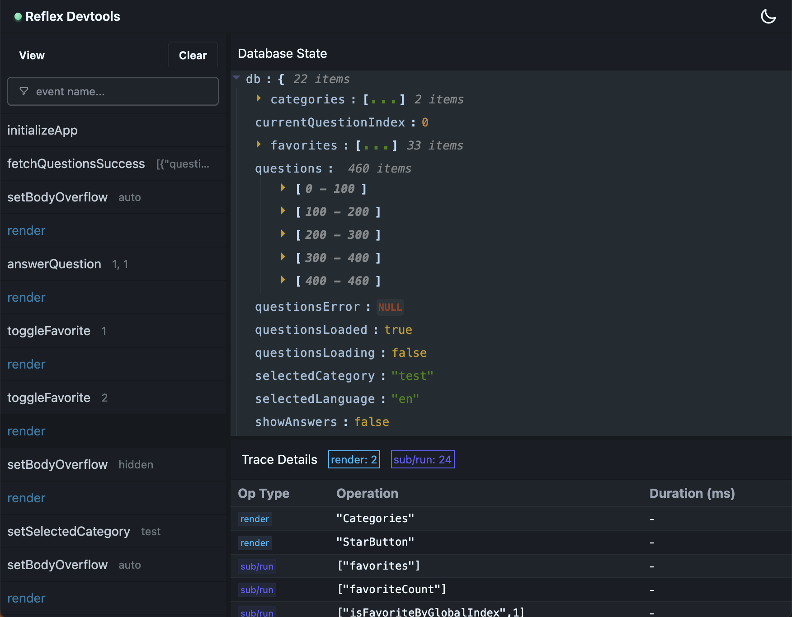

<div align="center">
  

  # 🛠️ Reflex DevTools

  **Runtime observability for Reflex apps — built for AI agents first, humans second**

  [](https://opensource.org/licenses/MIT)
  [](https://www.npmjs.com/package/@flexsurfer/reflex-devtools)
  [](https://github.com/flexsurfer/reflex/pulls)


  
</div>

---

## ✨ What is Reflex DevTools?

Reflex DevTools gives anything working on a [`@flexsurfer/reflex`](https://github.com/flexsurfer/reflex) app — a coding agent or a human — live access to the running application: current state, registered handlers, execution traces, and the ability to dispatch events and observe exactly what they did.

For **AI agents** (Claude Code, Codex, Cursor), that turns debugging from "read the source and guess" into an act-and-verify loop over [MCP](https://modelcontextprotocol.io): dispatch an event, get back the state patches it committed and the effects it emitted, no full-state dumps, no browser required.

For **humans**, the same server hosts a real-time web dashboard with state inspection, event tracing, and performance profiling.

---

## 🤖 Agentic Development

### The two-step path

Install the [Reflex Agent Toolkit](https://github.com/flexsurfer/reflex-agent-toolkit) plugin once, globally — it teaches your agent the whole Reflex workflow (skills + MCP configuration):

**Claude Code**

```text
/plugin marketplace add flexsurfer/reflex-agent-toolkit
/plugin install reflex-agent-toolkit@reflex-agent-toolkit
```

**Codex**

```bash
codex plugin marketplace add flexsurfer/reflex-agent-toolkit
# then inside Codex: /plugins → install "Reflex Agent Toolkit"
```

Then just ask for the outcome you want:

```text
> Create a React/Vite site using Reflex (@flexsurfer/reflex).

> Migrate this app's state management to Reflex (@flexsurfer/reflex).

> Add category filtering and verify it works.
```

That's it. The plugin's skill drives the agent through everything this README used to ask of you: it installs `@flexsurfer/reflex` and `@flexsurfer/reflex-devtools` in the project, wires up dev-only tracing, adds and starts the project-local `devtools:mcp` server script, and verifies its own work through the MCP tools instead of re-reading source files.

### What the agent gets

The plugin starts a version-pinned MCP bridge ([@flexsurfer/reflex-devtools-mcp](https://github.com/flexsurfer/reflex/tree/main/packages/reflex-devtools-mcp)) that connects to the project-local DevTools server:

| Tool | What it answers |
|---|---|
| `app_status` | Is an app connected? Browser or headless? Did it restart since I last looked? |
| `get_handlers` | Which event/effect/subscription ids exist? |
| `get_app_state` | What is the state *at this path* (scoped reads, not full dumps)? |
| `eval_sub` | What does any registered subscription return, mounted or not? |
| `get_active_subs` | What are the current values of mounted subscriptions and their active dependencies? |
| `dispatch_event` | Act — and get back the outcome: state patches, emitted effects, or the error |
| `get_traces` / `get_trace` | What happened recently, including what the agent didn't initiate? |

The write loop is `dispatch_event`: its response already contains the observed outcome (`succeeded` / `failed` / `effects-failed`) with the state diff and effects, so the agent verifies each change without a follow-up state read. The read-side counterpart is `eval_sub`, which proves a derived value before any view mounts it. Typo'd handler ids come back as `missing-handler`, not silent no-ops.

### Manual setup (Cursor, Claude Desktop, or no plugin)

If you're not using the agent toolkit plugin, the setup the skill automates is four small steps:

1. **Install DevTools in your project:**
   ```bash
   npm install --save-dev @flexsurfer/reflex-devtools
   ```

2. **Enable it in development** (app entry point; adjust the env guard for non-Vite apps):
   ```typescript
   import { enableTracing } from '@flexsurfer/reflex';
   import { enableDevtools } from '@flexsurfer/reflex-devtools';

   if (import.meta.env.DEV) {
     enableTracing();
     enableDevtools();
   }
   ```

3. **Add and run the project-local server script** (`--mcp` enables trace storage — without it the MCP tools have nothing to read):
   ```json
   {
     "scripts": {
       "devtools:mcp": "reflex-devtools --mcp --host 127.0.0.1 --port 4000"
     }
   }
   ```
   ```bash
   npm run devtools:mcp
   ```

4. **Point your MCP client at the bridge** (Claude Desktop: `~/Library/Application Support/Claude/claude_desktop_config.json`; Cursor: `.cursor/mcp.json`):
   ```json
   {
     "mcpServers": {
       "reflex-devtools": {
         "command": "npx",
         "args": [
           "--yes",
          "--package=@flexsurfer/reflex-devtools-mcp@0.1.13",
           "reflex-devtools-mcp",
           "--host",
           "127.0.0.1",
           "--port",
           "4000"
         ]
       }
     }
   }
   ```

Then run your app (browser tab or headless, below) and ask the agent things like:
- "What's the current app state and what user actions led to it?"
- "Find event handlers slower than 100ms"
- "Dispatch `user-login` with a test user and tell me what changed"

📚 **[Full MCP documentation →](https://github.com/flexsurfer/reflex/blob/main/packages/reflex-devtools-mcp/README.md)**

### Headless runtime — no browser required

The Reflex state layer is React-free, so an autonomous agent doesn't need a browser tab to run your app. Add a `src/headless.ts` entry that imports the same `db`/`events`/`subs` modules as `main.tsx` plus Node-safe side-effect adapters (`effects.headless.ts` / `coeffects.headless.ts` twins of your browser adapters), calls `enableTracing()` + `enableDevtools()`, and run it under `tsx watch` (or `vite-node --watch`).

The SDK auto-detects `runtime: 'headless'`, connects exactly like a browser tab, and every MCP tool works against it. `app_status` reports the runtime, the effect adapter modes (so the agent knows `local-storage-set` is memory-backed, not real), and a `sessionEpoch` that bumps on every reload so agents notice restarts — trace ids reset, seeded state gone.

Headless mode requires **Node.js 22+** (the SDK connects through the global `WebSocket`). On older Node it refuses loudly instead of half-working.

See the [DevTools playground](https://github.com/flexsurfer/reflex/tree/main/examples/devtools-playground) for the reference scaffold (`pnpm dev:playground:headless`) and the [MCP README](https://github.com/flexsurfer/reflex/blob/main/packages/reflex-devtools-mcp/README.md#-headless-runtime-for-autonomous-agent-loops) for the adapter-split convention.

> **⚠️ Security note:** DevTools and its MCP API are development-only tools with no authentication — the HTTP API can read app state, and `/api/dispatch` (with `--mcp`) can mutate it. Never expose the server to the public internet; only bind `--host 0.0.0.0` on trusted local networks.

---

## 🧑 Human Development

The same server hosts a web dashboard — pleasant for humans, and the visual counterpart of everything the agent sees:

- **📊 Database State Inspection** — visualize your entire application state in real-time
- **🔄 Real-time Event Tracing** — watch events and state changes as they happen
- **🔥 Subscriptions & Render Tracing** — see subscriptions being created, run, and disposed
- **⏱ Performance Profiling** — find slow events and subscriptions as they happen
- **🎨 Dark/light themes**, React & React Native support

If your project is already set up for agents (above), the dashboard is already there: open [http://localhost:4000](http://localhost:4000) while `devtools:mcp` is running.

Starting from scratch, without the MCP parts:

```bash
npm install --save-dev @flexsurfer/reflex-devtools
```

```typescript
// app entry point
import { enableTracing } from '@flexsurfer/reflex';
import { enableDevtools } from '@flexsurfer/reflex-devtools';

enableTracing();
enableDevtools(); // defaults to localhost:4000
```

```json
{
  "scripts": {
    "devtools": "reflex-devtools"
  }
}
```

```bash
npm run devtools
```

Then open [http://localhost:4000](http://localhost:4000).

---

## 🔧 Configuration Reference

### Client (`enableDevtools`)

```typescript
interface DevtoolsConfig {
  serverUrl?: string;  // Default: 'localhost:4000'
  enabled?: boolean;   // Default: true

  // Runtime self-description, surfaced to agents via the MCP app_status tool.
  // Auto-detected: 'react-native' via navigator.product, 'headless' when there
  // is no window (Node under tsx/vite-node), 'browser' otherwise.
  runtime?: 'browser' | 'headless' | 'react-native';
  // Free-form side-effect policy label, e.g. 'real' or 'safe'
  effectMode?: string;
  // Adapter mode per effect/coeffect id, e.g. { 'local-storage-set': 'memory' }
  effects?: Record<string, string>;
}
```

### Server CLI

```bash
reflex-devtools [options]

Options:
  -p, --port <port>       Port to run the server on (default: 4000)
  -h, --host <host>       Host to bind the server to (default: localhost)
  --mcp                   Enable MCP support with trace storage
  --max-traces <number>   Maximum traces to store (default: 1000, requires --mcp)
  --help                  Show this help message
```

---

## 🏗️ Architecture

```
┌─────────────────┐    WebSocket/HTTP    ┌─────────────────┐
│   Your App      │ ◀──────────────────▶ │  DevTools       │
│  (browser tab   │                      │  Server         │
│   or headless)  │                      │                 │
│ - Reflex SDK    │                      │ - Express API   │
│ - DevTools SDK  │                      │ - WebSocket     │
└─────────────────┘                      │ - Trace storage │
                                         └───────┬─────────┘
                                     HTTP │              │ HTTP
                                          ▼              ▼
                                ┌──────────────┐  ┌──────────────────┐
                                │  Dashboard   │  │  MCP Bridge      │
                                │  (React UI,  │  │  (stdio) → agent │
                                │   humans)    │  │                  │
                                └──────────────┘  └──────────────────┘
```

1. **Client SDK** (`/client`) — lightweight SDK that runs inside your app
2. **DevTools Server** (`/server`) — Express + WebSocket server with trace storage
3. **Web Dashboard** (`/ui`) — React debugging interface for humans
4. **MCP Bridge** ([reflex-devtools-mcp](https://github.com/flexsurfer/reflex/tree/main/packages/reflex-devtools-mcp)) — stateless stdio server for AI agents

---

## 🛠️ Development & Contributing

We welcome contributions!

### Prerequisites

- A Node.js version supported by the workspace (`^22.18.0` or `>=24.11.0`)
- pnpm 10.13.1

### Setup

```bash
git clone https://github.com/flexsurfer/reflex.git
cd reflex
pnpm install
pnpm build
```

Use the development commands below to start the DevTools server on `localhost:4000`, the UI dev server with hot reload on `localhost:5173`, and the playground on `localhost:3000`.

### Project Structure

```
packages/
├── reflex/                 # Core @flexsurfer/reflex package
├── reflex-devtools/        # Main package (client SDK + server)
│   ├── src/client/         # Client SDK for apps
│   ├── src/server/         # DevTools server
│   └── src/cli.ts          # CLI entry point
├── reflex-devtools-ui/     # Private React web dashboard
└── reflex-devtools-mcp/    # MCP server for AI assistants
    ├── src/tools/          # MCP tool implementations
    └── src/cli.ts          # MCP CLI entry point
examples/
└── devtools-playground/    # Browser + headless reference app
```

### Development Commands

```bash
pnpm build                       # Build all packages and examples
pnpm test                        # Build, then run all unit tests
pnpm dev:server                  # Build and start the DevTools server
pnpm dev:ui                      # Start the dashboard in development mode
pnpm dev:playground              # Start the playground in a browser
pnpm dev:playground:headless     # Start the playground headless under vite-node
node packages/reflex-devtools/dist/cli.js --mcp --host 127.0.0.1 --port 4000
pnpm clean                       # Clean all workspace builds
```

For the `AGENTS.md` guidance template shipped with Reflex, see [`packages/reflex/templates/agent/AGENTS.md`](https://github.com/flexsurfer/reflex/blob/main/packages/reflex/templates/agent/AGENTS.md).

### Making Changes

1. **Fork** the repository
2. **Create** a feature branch: `git checkout -b feature/amazing-feature`
3. **Make** your changes and **test** with the DevTools playground
4. **Commit** using conventional commits: `git commit -m 'feat: add amazing feature'`
5. **Push** and create a **Pull Request**

---

## 📄 License

MIT License - see [LICENSE](LICENSE) file for details.

---

## 🙏 Acknowledgments

Built with ❤️ for the Reflex community. Special thanks to all contributors and the open-source projects that make this possible.

---

<div align="center">

  **Happy Debugging! 🐛➡️✨**

  Made by [@flexsurfer](https://github.com/flexsurfer)

</div>
