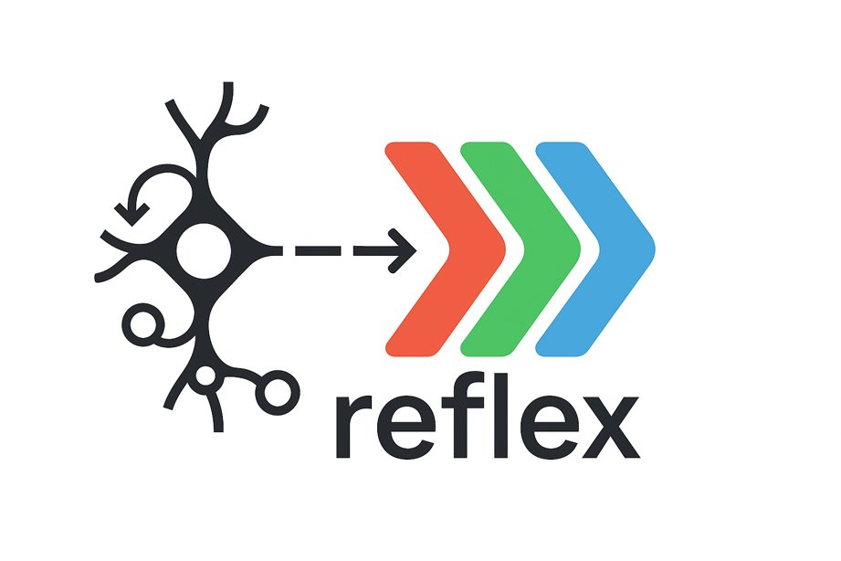

<div align="center">
  
</div>

**Reactive state management for React & React Native — built for AI agentic development**

Pure event handlers over an instance-owned state, derived subscriptions, isolated side effects. An architecture coding agents can generate, observe at runtime, and verify — and humans can still read.

[](https://opensource.org/licenses/MIT)
[](https://www.npmjs.com/package/@flexsurfer/reflex)
[](https://github.com/flexsurfer/reflex/pulls)

## 🤖 AI Agentic Development

Reflex is designed to be written _and driven_ by coding agents. The whole setup is two steps.

**1. Install the [Reflex Agent Toolkit](https://github.com/flexsurfer/reflex-agent-toolkit) plugin** — once, globally:

Claude Code:

```text
/plugin marketplace add flexsurfer/reflex-agent-toolkit
/plugin install reflex-agent-toolkit@reflex-agent-toolkit
```

Codex:

```bash
codex plugin marketplace add flexsurfer/reflex-agent-toolkit
# then inside Codex: /plugins → install "Reflex Agent Toolkit"
```

**2. Ask for what you want:**

```text
> Create a React/Vite site using Reflex (@flexsurfer/reflex).

> Migrate this app's state management to Reflex (@flexsurfer/reflex).
```

The plugin ships the Reflex skill (workflow, conventions, progressive references) and the [DevTools](https://github.com/flexsurfer/reflex/tree/main/packages/reflex-devtools) MCP configuration. From there the agent handles the project itself: installs dependencies, wires dev-only tracing, starts the project-local devtools server, and **verifies its own changes at runtime** instead of re-reading source files — `dispatch_event` returns the state patches an event committed, the effects it emitted, or the error if it failed.

### Why agents are effective with Reflex

- **All logic is pure functions** over an instance-owned state. Every change is small, isolated, and deterministic — easy to generate, easy to review.
- **Everything is addressable by id.** Events, subscriptions, and effects are registered under ids, so an agent looks up the one handler it needs instead of reading store files end-to-end.
- **The running app is observable.** Through the DevTools MCP an agent checks app health, lists handlers, reads state by path, watches live subscription values, and inspects traces of everything that happened — including what it didn't initiate.
- **No browser required.** The state layer is React-free: a headless entry runs the full app under Node, so autonomous agent loops and CI drive the real thing.

### Without the plugin

Copy the tiny router files into your app — they point agents at Reflex conventions without bloating context:

```bash
cp node_modules/@flexsurfer/reflex/templates/agent/AGENTS.md ./AGENTS.md
cp node_modules/@flexsurfer/reflex/templates/agent/CLAUDE.md ./CLAUDE.md
```

For the runtime loop, the project needs a local DevTools script (the plugin's setup skill creates it when missing):

```json
{
  "scripts": {
    "devtools:mcp": "reflex-devtools --mcp --allow-dispatch --host 127.0.0.1 --port 4000 --allow-origin http://localhost:5173"
  }
}
```

Omit `--allow-dispatch` for a read-only inspection session. Mutation is never
enabled implicitly by `--mcp`. Replace the `--allow-origin` value with the
exact origin of your browser dev server, or omit it for a headless-only app.

Manual MCP client configs are included as templates:

```bash
# Codex (trusted projects only)
mkdir -p .codex && cp node_modules/@flexsurfer/reflex/templates/agent/codex-config.toml .codex/config.toml

# Claude Code / Cursor
cp node_modules/@flexsurfer/reflex/templates/agent/mcp.json .mcp.json
mkdir -p .cursor && cp node_modules/@flexsurfer/reflex/templates/agent/mcp.json .cursor/mcp.json
```

The complete Reflex reference for AI assistants ships in the package as [`llms.txt`](./llms.txt) (`node_modules/@flexsurfer/reflex/llms.txt`). Use it as a fallback/reference — don't paste it into always-loaded instructions; the plugin skill is the efficient path.

## ✨ The architecture in 30 seconds

```bash
npm install @flexsurfer/reflex
```

```tsx
import { createReflexRuntime } from '@flexsurfer/reflex/vanilla';
import { ReflexProvider, useSubscription } from '@flexsurfer/reflex/react';

const runtime = createReflexRuntime({
  initialState: { counter: 0 },
  runtimeId: 'counter-app',
  name: 'Counter app',
});

// A module owns its registrations and can be disposed safely.
runtime.registerModule((scope) => {
  scope.regEvent('counter/increment', ({ draftState }) => {
    draftState.counter += 1;
  });
  scope.regRootSub('counter', 'counter');
});

function Counter() {
  const count = useSubscription(['counter']);
  return <button onClick={() => runtime.dispatch(['counter/increment'])}>Count: {count}</button>;
}

function Root() {
  return (
    <ReflexProvider runtime={runtime}>
      <Counter />
    </ReflexProvider>
  );
}
```

Each runtime owns its state, event queue, handlers, subscription graph,
tracing, and inspector. Create one per browser root, SSR request, embedded
widget, story, test, or agent sandbox whenever those worlds must be isolated.

There is no package-global runtime. React hooks require a `ReflexProvider` and
receive a dispatch/subscription-only client facade. Registration, persistence,
and lifecycle work go through the runtime owner; inspection and focused test
access require the explicit `@flexsurfer/reflex/devtools` and
`@flexsurfer/reflex/testing` subpaths.

### Subscription runtime

Reflex settles changed subscription graphs in one STATE-driven topological wave before notifying React. Active snapshots are cache-only, dormant reads are memoized pulls, equality cuts off downstream work, and computed nodes are evicted when their last consumer leaves. The runtime invariants and work budgets are documented in [`docs/subscription-runtime.md`](./docs/subscription-runtime.md).

Side effects (HTTP, storage, timers, navigation) live in **effects/coeffects**, registered by id and emitted from event handlers as data — which is what keeps handlers pure, apps portable across web/mobile/desktop, and behavior verifiable by tools.

## 🎯 Why Reflex?

🎯 **Predictable State Management** - Unidirectional data flow with pure functions  
🧩 **Composable Architecture** - Build complex apps from simple, reusable pieces  
🔄 **Reactive Subscriptions** - UI automatically updates when state changes  
🌐 **Multi-Platform Support** - With effects separation, it's super easy to support multiple platforms with the same codebase, including web, mobile, and desktop  
🤖 **AI Friendly** - All logic is expressed through pure, isolated functions, making each change understandable, verifiable, and deterministic — and the DevTools MCP lets agents verify changes against the running app  
🛠️ **Integrated DevTools** - [`@flexsurfer/reflex-devtools`](https://github.com/flexsurfer/reflex/tree/main/packages/reflex-devtools) provides deep visibility into your app's state, events, and subscriptions in real time — a dashboard for humans, an MCP API for agents  
⚡ **Interceptor Pattern** - Powerful middleware system for cross-cutting concerns  
🛡️ **Type Safety** - Full TypeScript support with excellent IDE experience  
🧪 **Testability** - Pure functions make testing straightforward and reliable

## 📚 Learn More

- [Documentation](https://reflex.js.org/docs/)
- [Step-by-Step Tutorial](https://reflex.js.org/docs/quick-start.html)
- [Best Practices](https://reflex.js.org/docs/api-reference.html)
- [API Reference](https://reflex.js.org/docs/best-practices.html)
- [Re-frame parity tradeoffs](./docs/re-frame-parity-tradeoffs.md) - What Reflex gains, pays,
  and should improve in its JavaScript implementation
- [AI Reference (llms.txt)](./llms.txt) - Full Reflex guide for AI assistants; use as a fallback/reference, not as always-loaded instructions

- Examples
  - [TodoMVC](https://github.com/flexsurfer/reflex/tree/main/examples/todomvc) - Classic todo app implementation showcasing core reflex patterns
  - [Issue Triage Board](https://github.com/flexsurfer/reflex-demo) - Demo app built with reflex architecture rules ([Live Video](https://www.youtube.com/watch?v=xwv5SwlF4Dg))
  - [Einbürgerungstest](https://github.com/flexsurfer/einburgerungstest/) - Cross-platform web/mobile app built with reflex ([Live Demo](https://www.ebtest.org/))
  - [StarRupture Planner](https://github.com/flexsurfer/starrupture-planner) - Production planning tool built with reflex ([Live Demo](https://www.starrupture-planner.com/))

## 🌱 Heritage: re-frame and ClojureScript

Reflex is **re-frame for the JavaScript world**. After many years of building applications with [re-frame](https://day8.github.io/re-frame/re-frame/) in ClojureScript, I wanted to bring the same architectural elegance to the JavaScript/TypeScript ecosystem. This is not just another state management library — it's a **battle-tested** pattern that has been a joy to work with for over a decade.

📚 **Want to understand the philosophy behind this approach?** Check out the amazing [re-frame documentation](https://day8.github.io/re-frame/re-frame/) which describes the greatness of this framework in the finest details. Everything you learn there applies to reflex! Though we do lose some of ClojureScript's natural immutability magic. Immer helps bridge this gap, but it's not quite as elegant or efficient as CLJS persistent data structures.

## 🤝 Contributing

Contributions are welcome! Please feel free to submit a Pull Request or file an issue with questions, suggestions, or ideas. Implementation changes should follow the [code conventions and module ownership rules](./docs/code-conventions.md).

## 📄 License

MIT © [flexsurfer](https://github.com/flexsurfer)

---

_Bringing the wisdom of ClojureScript's re-frame to the JavaScript world — now with an agent loop the original never had._
